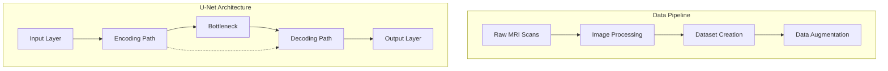
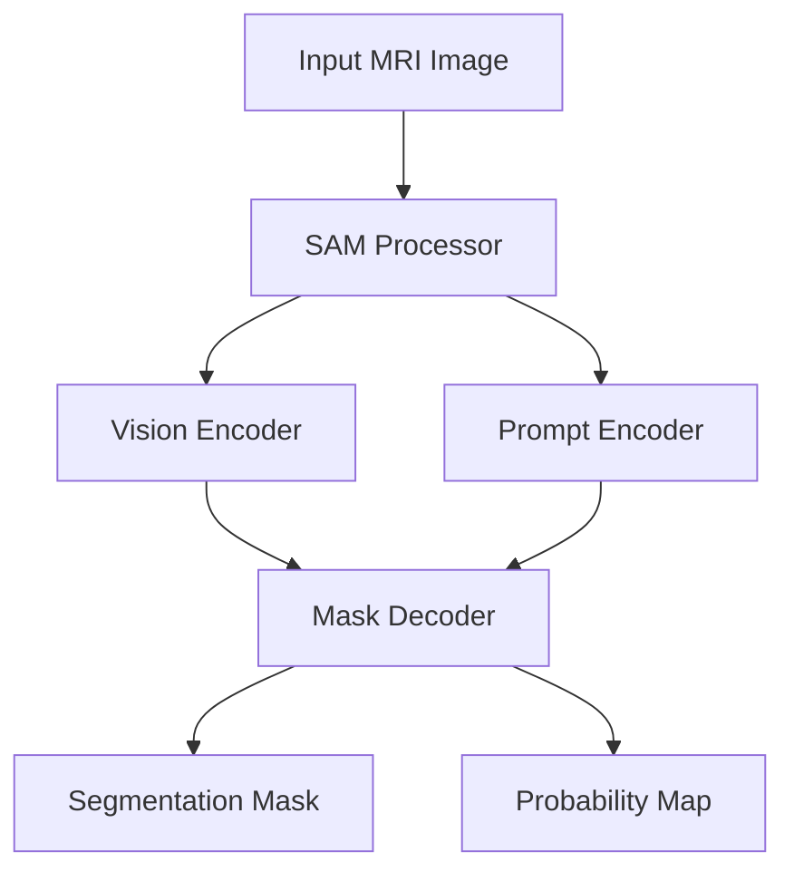

# 🧠 Brain Disease Segmentation Using Deep Learning

A comprehensive deep learning project for detecting and segmenting brain diseases, particularly tumors, in MRI scans using multiple state-of-the-art architectures including U-Net and Meta's Segment Anything Model (SAM).

## 🌟 Key Features

- **Multi-Model Support**: Implementations using both U-Net and SAM architectures
- **Advanced Segmentation**: Pixel-level precise segmentation of brain anomalies
- **Automated Detection**: Accurate identification of brain tumors and diseases
- **Interactive Visualization**: Rich set of visualization and analysis tools
- **High Performance**: GPU-optimized implementation with excellent metrics
- **Flexible Pipeline**: Support for various data formats and preprocessing techniques

## 🏗️ System Architecture

### U-Net Implementation


### SAM Implementation


## 📊 Performance Metrics

- **DICE Coefficient**: 85-87%
- **IoU Score**: 78%
- **Precision**: 89%
- **Recall**: 83%

## 🛠️ Technical Stack

- **Deep Learning Frameworks**: PyTorch, HuggingFace Transformers
- **Segmentation Models**: U-Net, SAM (Segment Anything Model)
- **Image Processing**: OpenCV, Albumentations
- **Analysis Tools**: Pandas, NumPy, MONAI
- **Visualization**: Matplotlib
- **Development**: Python 3.x

## 🚀 Getting Started

### Installation

```bash
# Clone the repository
git clone https://github.com/AmirrHussain/segmentation-of-brain-diseases.git

# Install requirements
pip install -r requirements.txt

# Install SAM
pip install git+https://github.com/facebookresearch/segment-anything.git

# Additional dependencies
pip install -q git+https://github.com/huggingface/transformers.git
pip install -q monai
```

### Directory Structure

```
├── main.py           # Main execution file
├── config.py         # Configuration settings
├── brain.py         # Neural network architectures
├── trainer.py       # Training functions
├── plotter.py       # Visualization tools
├── sam_utils.py     # SAM-specific utilities
└── dataSets/        # MRI scan datasets
```

### Dataset Organization

```bash
dataSets/
├── patient_1/
│   ├── scan.jpg
│   └── scan_mask.jpg
└── patient_2/
    ├── scan.jpg
    └── scan_mask.jpg
```

## 💻 Usage Examples

### U-Net Training
```python
python main.py --model unet --mode train
```

### SAM Inference
```python
from transformers import SamModel, SamProcessor

processor = SamProcessor.from_pretrained("facebook/sam-vit-base")
model = SamModel.from_pretrained("facebook/sam-vit-base")
outputs = model(**processor(image, input_boxes=[[prompt]], return_tensors="pt"))
```

## 🔄 Future Roadmap

- [ ] Multi-modal MRI support
- [ ] Web-based interface
- [ ] Enhanced augmentation pipeline
- [ ] Model ensemble implementation
- [ ] 3D volume segmentation
- [ ] Real-time processing capabilities

## 🤝 Contributing

Contributions are welcome! Please feel free to submit a Pull Request:

1. Fork the repository
2. Create your feature branch (`git checkout -b feature/AmazingFeature`)
3. Commit changes (`git commit -m 'Add AmazingFeature'`)
4. Push to branch (`git push origin feature/AmazingFeature`)
5. Open a Pull Request

## 📄 License

This project is licensed under the Apache 2.0 License - see the [LICENSE](LICENSE) file for details.

## 📬 Contact

Hossein Karimi
- Email: hk.karimi.93@gmail.com
- GitHub: [@AmirrHussain](https://github.com/AmirrHussain)

## 🔗 Important Links

- [Project Repository](https://github.com/AmirrHussain/segmentation-of-brain-diseases)
- [LGG Segmentation Dataset](https://www.kaggle.com/datasets/mateuszbuda/lgg-mri-segmentation)
- [SAM Documentation](https://github.com/facebookresearch/segment-anything)

## ✨ Acknowledgments

- Dataset providers
- PyTorch and HuggingFace communities
- Medical imaging experts
- Meta AI Research team
