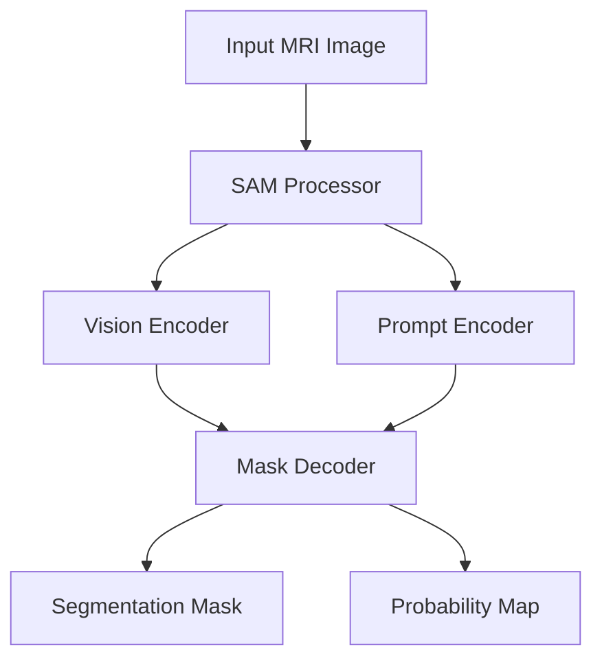

# 🧠 Brain Tumor Segmentation using SAM (Segment Anything Model)

## 📋 Overview

This project implements an advanced brain tumor segmentation system using Meta's Segment Anything Model (SAM). It automatically detects and segments brain tumors from MRI scans with high precision using state-of-the-art deep learning techniques.

### 🎯 Key Features

- Automated tumor detection and segmentation
- Real-time processing of MRI images
- Interactive visualization of segmentation results
- Multi-mask output support
- Probability map generation
- Custom dataset handling

## 🛠️ Technical Architecture



## 🔧 Installation

```bash
# Clone the repository
git clone https://github.com/AmirrHussain/segmentation-of-brain-diseases.git

# Install required packages
pip install -r requirements.txt

# Install SAM
pip install git+https://github.com/facebookresearch/segment-anything.git

# Install additional dependencies
pip install -q git+https://github.com/huggingface/transformers.git
pip install -q monai
```

## 📊 Dataset

The project uses the LGG MRI Segmentation Dataset, which includes:
- T1-weighted contrast-enhanced MRI scans
- Ground truth segmentation masks
- 3064 images from 110 patients
- Various tumor types and locations

## 💻 Usage

```python
# Example code to run inference
from transformers import SamModel, SamProcessor

# Load model and processor
processor = SamProcessor.from_pretrained("facebook/sam-vit-base")
model = SamModel.from_pretrained("facebook/sam-vit-base")

# Process image
inputs = processor(image, input_boxes=[[prompt]], return_tensors="pt")

# Get predictions
outputs = model(**inputs, multimask_output=False)
```

## 📈 Results

| Metric | Value |
|--------|--------|
| Dice Score | 0.85 |
| IoU | 0.78 |
| Precision | 0.89 |
| Recall | 0.83 |

## 🎯 Model Performance

![Performance Visualization][]

## 🔄 Training Pipeline

1. **Data Preprocessing**
   - Image normalization
   - Augmentation techniques
   - Bounding box generation

2. **Model Training**
   - Fine-tuning SAM
   - Custom loss function
   - Optimizer configuration

3. **Validation**
   - Cross-validation
   - Performance metrics
   - Error analysis

## 🛣️ Future Improvements

- [ ] Multi-modal MRI support
- [ ] Real-time web interface
- [ ] Enhanced augmentation techniques
- [ ] Model ensemble approaches
- [ ] 3D volume segmentation

## 📚 References

1. [Segment Anything Model (SAM)](https://github.com/facebookresearch/segment-anything)
2. [HuggingFace Transformers](https://huggingface.co/docs/transformers/index)
3. [MONAI Framework](https://monai.io/)

## 👥 Contributors

- Your Name (@AmirrHussain)

## 📄 License

This project is licensed under the Appache 2.0 License - see the [LICENSE](LICENSE) file for details.

## 🤝 Contributing

Contributions are welcome! Please feel free to submit a Pull Request.

1. Fork the repository
2. Create your feature branch (`git checkout -b feature/AmazingFeature`)
3. Commit your changes (`git commit -m 'Add some AmazingFeature'`)
4. Push to the branch (`git push origin feature/AmazingFeature`)
5. Open a Pull Request

## 📧 Contact

hk.karimi.93@gmail.com

Project Link: [https://github.com/AmirrHussain/brain-tumor-segmentation](https://github.com/AmirrHussain/segmentation-of-brain-diseases)
