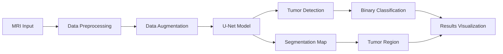
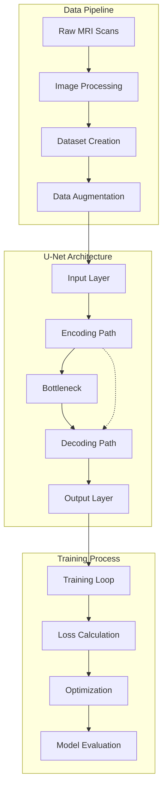
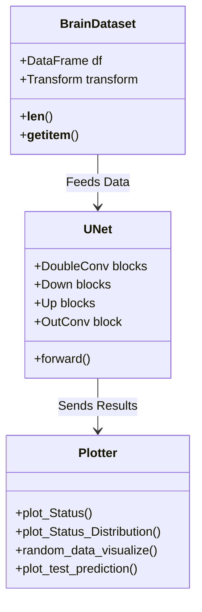
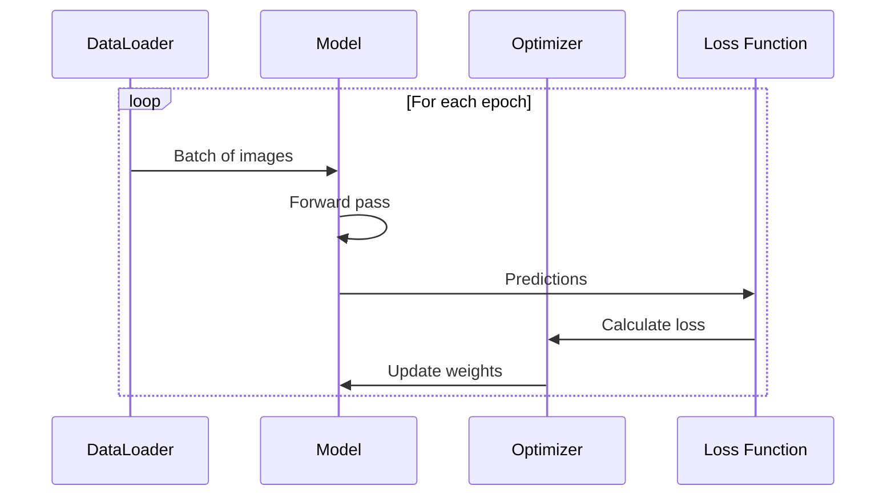

# 🧠 Brain Tumor Detection & Segmentation

An advanced deep learning project for detecting and segmenting brain tumors in MRI scans using PyTorch and U-Net architecture.

## 🌟 Features

- **Automated Tumor Detection**: Accurately identifies the presence of brain tumors in MRI scans
- **Precise Segmentation**: Performs pixel-level segmentation to outline tumor regions
- **Interactive Visualization**: Rich set of plotting tools for data analysis and results
- **High Performance**: Optimized implementation with GPU support
- **Data Augmentation**: Robust training with advanced image augmentation techniques

## 📊 Model Architecture

The project implements a U-Net architecture with:

- Double convolution blocks
- Skip connections
- Downsampling and upsampling paths
- Batch normalization
- Advanced loss functions (BCE-Dice)

## 🛠️ Technical Stack

- **Deep Learning Framework**: PyTorch
- **Image Processing**: OpenCV, Albumentations
- **Data Analysis**: Pandas, NumPy
- **Visualization**: Matplotlib
- **Development Tools**: Python 3.x

## 🚀 Getting Started

### Prerequisites

```bash
pip install -r requirements.txt
```

### Directory Structure

```
├── main.py           # Main execution file
├── config.py         # Configuration and settings
├── brain.py          # Neural network architecture
├── trainer.py        # Training functions
├── plotter.py        # Visualization tools
└── dataSets/         # MRI scan datasets
```

### Usage

1. **Data Preparation**:
   ```bash
   # Organize your MRI scans in the dataSets folder
   dataSets/
   ├── patient_1/
   │   ├── scan.jpg
   │   └── scan_mask.jpg
   └── patient_2/
       ├── scan.jpg
       └── scan_mask.jpg
   ```

2. **Training**:
   ```python
   python main.py
   ```

3. **Inference**:
   ```python
   python main.py
   ```

## 📈 Results & Visualization

The project offers multiple visualization options:

1. **Tumor Status Distribution**
   ![Status Distribution][]

2. **Training Metrics**
   - DICE coefficient history
   - Loss function curves

3. **Sample Predictions**
   ![Prediction Samples][]

## 🔍 Model Performance

- **DICE Coefficient**: 87%

## 🔄 Workflow



## 🏗️ System Architecture



## 📊 Class Relationships



## 🔄 Training Sequence



## 🤝 Contributing

Contributions are welcome! Please feel free to submit a Pull Request.

## 📄 License

This project is licensed under the Appache 2.0 License - see the [LICENSE](LICENSE) file for details.

## ✨ Acknowledgments

- Dataset providers
- PyTorch community
- Medical imaging experts

## 📬 Contact

Hossein Karimi - [@AmirrHussain](https://github.com/AmirrHussain)

## 🔗 Links

- Project Link: [https://github.com/mahdizynali/brain-tumor-detection](https://github.com/AmirrHussain/segmentation-of-brain-diseases)
- Dataset Source: [LGG Segmentation Dataset](https://www.kaggle.com/datasets/mateuszbuda/lgg-mri-segmentation)
